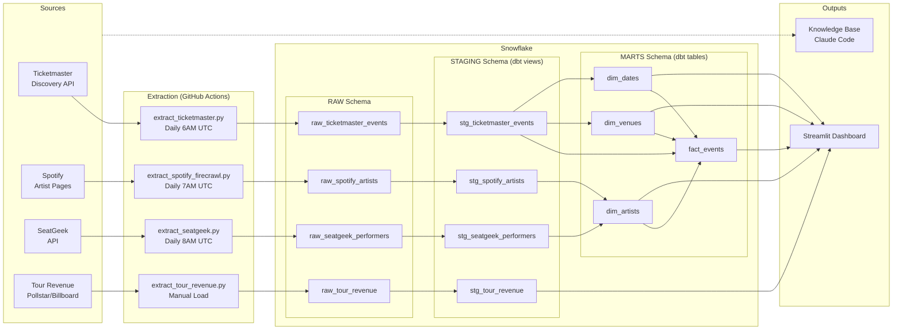
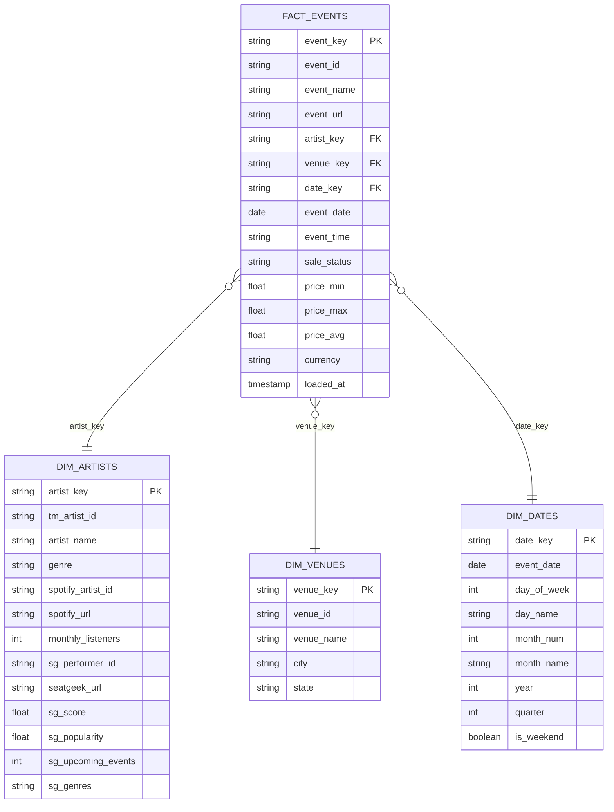

# Live Music Analytics Pipeline

An end-to-end data pipeline combining four data sources — Ticketmaster events, Spotify streaming metrics, SeatGeek ticketing demand signals, and verified tour revenue from industry sources — to generate business intelligence insights for the live entertainment industry. Built to mirror the analytical workflows of a Sr. BI Analyst at AXS (AEG Worldwide).

## Project Overview

The live entertainment industry increasingly relies on data to drive booking, pricing, and marketing decisions. But the signals that predict live music demand live in separate silos:

- **Spotify** measures **passive demand** — how many people are listening to an artist
- **SeatGeek** measures **active demand** — how many people are searching for and buying tickets
- **Ticketmaster** represents **supply** — what events are actually booked and available
- **Tour revenue** (Pollstar/Billboard) provides **verified financial outcomes** — real gross revenue, tickets sold, and average ticket prices for major tours

When passive demand and active demand are both high but supply is low, that's a gap where the industry is leaving money on the table. The verified tour revenue data grounds the analysis in real financial outcomes — showing that live revenue for top artists exceeds streaming revenue by 100x or more. This project bridges those silos by extracting data from all four sources, loading it into a Snowflake data warehouse, transforming it through a dbt star schema, and visualizing insights through an interactive Streamlit dashboard.

This project was developed for ISBA 4715 (Developing Business Applications with SQL) and serves as a portfolio piece for BI and analytics roles in the music and entertainment industry.

## Tech Stack

| Tool | Purpose |
|------|---------|
| Python | Data extraction scripts (4 sources) |
| Snowflake | Cloud data warehouse |
| dbt | Data transformation (6 staging views + 4 mart tables, 17 tests) |
| Streamlit | Interactive 5-tab dashboard |
| GitHub Actions | Three automated daily extraction pipelines |
| Firecrawl | Web scraping for Spotify artist data |
| Claude Code | Knowledge base generation |

## Data Sources

| Source | Type | Data | Script | Schedule |
|--------|------|------|--------|----------|
| Ticketmaster Discovery API | REST API | 1,968 live music events with venues, pricing, genres | `src/extract_ticketmaster.py` | Daily 6AM UTC |
| Spotify Artist Pages | Web scrape (Firecrawl) | 30 artists with monthly listener counts | `src/extract_spotify_firecrawl.py` | Daily 7AM UTC |
| SeatGeek API | REST API | 21 performers with demand scores, popularity, and genre data | `src/extract_seatgeek.py` | Daily 8AM UTC |
| Tour Revenue (Pollstar/Billboard) | Manual + script | 20 artists with verified gross revenue, tickets sold, avg ticket price, and tour details | `src/extract_tour_revenue.py` | Manual load |

### What the SeatGeek metrics mean

- **SeatGeek Score (0–1):** A composite rating based on ticket sales velocity, listing volume, and price trends. Closer to 1.0 means near-peak demand — almost every listed event sells aggressively.
- **SeatGeek Popularity (raw number):** A ranking based on how often people search for an artist and how many tickets are being bought/sold. Higher number = more people actively looking for tickets. This is a volume signal — how much attention an artist is getting on the ticketing side.

### Why three sources matter

No single source tells the full story:
- An artist can have millions of Spotify listeners but no ticket demand (passive popularity without purchase intent)
- An artist can have a high SeatGeek score but low streaming numbers (core fan base that buys tickets but doesn't drive streaming volume)
- When **both** Spotify listeners and SeatGeek demand are high but Ticketmaster event count is zero, that's the strongest signal of untapped booking opportunity

The four-source approach lets a BI team triangulate real demand and validate it against verified financial outcomes, rather than relying on any one metric.

## Pipeline Diagram



## ERD — Star Schema



## Pipeline Setup

1. **Clone the repo**
   ```bash
   git clone https://github.com/your-username/bi-analyst-entertainment.git
   cd bi-analyst-entertainment
   ```

2. **Install dependencies**
   ```bash
   python -m venv venv
   source venv/bin/activate
   pip install -r requirements.txt
   ```

3. **Configure credentials**
   ```bash
   cp .env.example .env
   # Fill in your Ticketmaster, Firecrawl, SeatGeek, Snowflake credentials
   ```

4. **Run extraction scripts**
   ```bash
   python src/extract_ticketmaster.py
   python src/extract_spotify_firecrawl.py
   python src/extract_seatgeek.py
   python src/extract_tour_revenue.py
   ```

5. **Run dbt transformations**
   ```bash
   cd dbt_project
   dbt deps
   dbt run
   dbt test
   ```

6. **Launch the dashboard**
   ```bash
   # Create .streamlit/secrets.toml with Snowflake credentials (see .env.example)
   streamlit run streamlit_app.py
   ```

## Dashboard

<!-- Replace with your deployed Streamlit URL -->
**Live URL:** [Streamlit Dashboard](https://bi-analyst-entertainment-stxfzxc3geuznh29zyhnpe.streamlit.app/)

The dashboard includes 5 tabs:
- **Overview** — KPI cards, top genres/artists/venues, and a three-signal Artist Demand Signals table combining Spotify listeners, SeatGeek scores, and Ticketmaster event counts
- **Pricing Analytics** — Average price by genre, price distribution, verified tour revenue vs streaming revenue comparison, and Ticketmaster pricing for smaller acts
- **Artist Insights** — Individual artist cards with Spotify + SeatGeek + Ticketmaster metrics, verified tour revenue, and streaming-to-live revenue multipliers
- **Venues & Geography** — Event hotspot map, events by state, top venues, and market profiles by state
- **Time Trends** — Day of week patterns, monthly trends, and genre-by-day scheduling analysis

## Insights Summary

- **Three demand signals are stronger than one**: Combining Spotify listeners (passive demand), SeatGeek scores (active demand), and Ticketmaster events (supply) reveals booking gaps that no single source can identify
- **Thursday dominates scheduling**: 31% of all events fall on Thursday — more than Friday, Saturday, and Sunday combined — with a 77% drop from Thursday to Friday
- **Geographic concentration**: 5 states (CA, NY, NV, TX, TN) host 39% of all events, leaving most of the country underserved
- **Premium pricing in California**: CA charges nearly 2x New York's average ticket price ($67 vs $37) despite similar event volume, suggesting venue density drives premium pricing
- **Dynamic pricing creates a data blind spot**: 0% of major artist events expose pricing through public APIs — the highest-revenue events are the least transparent
- **Live revenue dwarfs streaming**: Verified tour gross revenue for top artists exceeds estimated annual streaming revenue by 100x or more

## Knowledge Base

The `knowledge/` directory contains research on why streaming and live performance data convergence matters for the entertainment industry.

- **`knowledge/raw/`** — 17 raw sources from 11+ sites (Billboard, Pollstar, Forbes, Spotify, IFPI, and more)
- **`knowledge/wiki/`** — Synthesized wiki pages: [industry overview](knowledge/wiki/overview.md), [key entities](knowledge/wiki/key-entities.md), [industry themes](knowledge/wiki/themes.md)
- **[Full Index](knowledge/wiki/index.md)**

## Repository Structure

```
bi-analyst-entertainment/
├── src/
│   ├── extract_ticketmaster.py        # Ticketmaster API extraction
│   ├── extract_spotify_firecrawl.py   # Spotify web scraping extraction
│   ├── extract_seatgeek.py           # SeatGeek API extraction
│   └── extract_tour_revenue.py       # Tour revenue data (Pollstar/Billboard)
├── dbt_project/
│   ├── models/
│   │   ├── staging/                   # 6 staging views + tests
│   │   └── marts/                     # Star schema (fact + dimensions)
│   ├── dbt_project.yml
│   ├── profiles.yml
│   └── packages.yml
├── .github/workflows/
│   ├── extract_ticketmaster.yml       # Daily Ticketmaster extraction (6AM UTC)
│   ├── extract_spotify.yml            # Daily Spotify extraction (7AM UTC)
│   └── extract_seatgeek.yml          # Daily SeatGeek extraction (8AM UTC)
├── knowledge/
│   ├── raw/                           # 17 raw industry sources
│   └── wiki/                          # Synthesized wiki pages
├── streamlit_app.py                   # Interactive 5-tab dashboard
├── docs/                              # Proposal + project docs
├── requirements.txt
├── .env.example                       # Credential template
└── CLAUDE.md                          # AI assistant context
```
