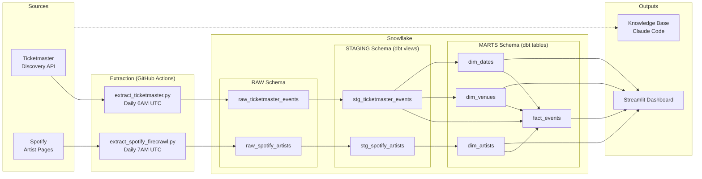
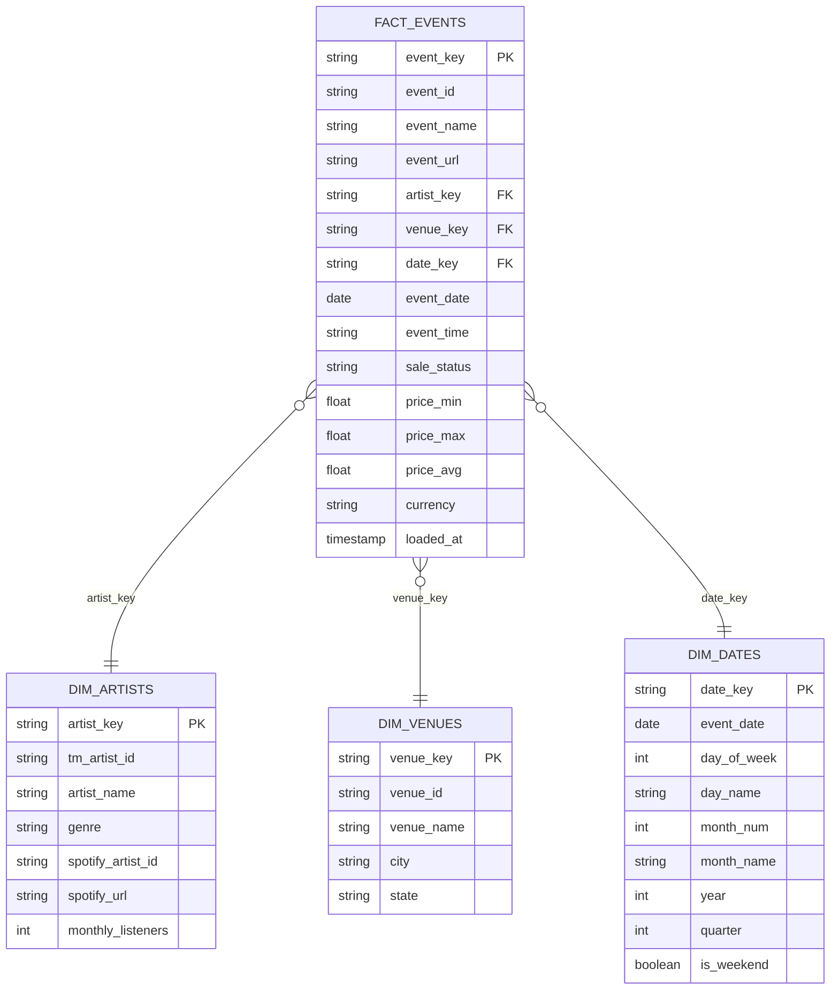

# Live Music Analytics Pipeline

An end-to-end data pipeline combining Ticketmaster event data with Spotify streaming metrics to generate business intelligence insights for the live entertainment industry. Built to mirror the analytical workflows of a Sr. BI Analyst at AXS (AEG Worldwide).

## Project Overview

The live entertainment industry increasingly relies on data to drive booking, pricing, and marketing decisions. Streaming metrics like Spotify monthly listeners have become leading indicators for ticket demand, yet ticketing and streaming data often live in silos.

This project bridges that gap by extracting data from the Ticketmaster Discovery API and Spotify artist pages, loading it into a Snowflake data warehouse, transforming it through a dbt star schema, and visualizing insights through an interactive Streamlit dashboard. The knowledge base documents the industry context behind why this convergence matters.

This project was developed for ISBA 4715 (Developing Business Applications with SQL) and serves as a portfolio piece for BI and analytics roles in the music and entertainment industry.

## Tech Stack

| Tool | Purpose |
|------|---------|
| Python | Data extraction scripts |
| Snowflake | Cloud data warehouse |
| dbt | Data transformation (staging + mart models) |
| Streamlit | Interactive dashboard |
| GitHub Actions | Automated extraction pipelines |
| Firecrawl | Web scraping for Spotify data |
| Claude Code | Knowledge base generation |

## Data Sources

| Source | Type | Data | Script |
|--------|------|------|--------|
| Ticketmaster Discovery API | REST API | Live music events, venues, pricing, genres | `src/extract_ticketmaster.py` |
| Spotify Artist Pages | Web scrape (Firecrawl) | Artist popularity, monthly listeners | `src/extract_spotify_firecrawl.py` |

## Pipeline Diagram



## ERD — Star Schema



## Pipeline Setup

1. **Clone the repo**
   ```bash
   git clone https://github.com/your-username/bi-analyst-entertainment.git
   cd bi-analyst-entertainment
   ```

2. **Install dependencies**
   ```bash
   python -m venv venv
   source venv/bin/activate
   pip install -r requirements.txt
   ```

3. **Configure credentials**
   ```bash
   cp .env.example .env
   # Fill in your Ticketmaster, Firecrawl, and Snowflake credentials
   ```

4. **Run extraction scripts**
   ```bash
   python src/extract_ticketmaster.py
   python src/extract_spotify_firecrawl.py
   ```

5. **Run dbt transformations**
   ```bash
   cd dbt_project
   dbt deps
   dbt run
   dbt test
   ```

6. **Launch the dashboard**
   ```bash
   # Create .streamlit/secrets.toml with Snowflake credentials (see .env.example)
   streamlit run streamlit_app.py
   ```

## Dashboard

<!-- Replace with your deployed Streamlit URL -->
**Live URL:** [Streamlit Dashboard](#)

The dashboard includes:
- **Event Overview** — KPI cards and events by genre
- **Pricing Analytics** — Average price by genre and price distribution
- **Artist Insights** — Scatter plot of Spotify listeners vs live event count (diagnostic)
- **Venue & Geography** — Events by state and top venues
- **Time Trends** — Day of week patterns and weekend vs weekday analysis

Interactive sidebar filters for genre, state, and price range.

## Insights Summary

- **Streaming predicts live demand**: Artists with higher Spotify monthly listeners tend to have more scheduled live events, validating the streaming-to-touring pipeline
- **Genre concentration**: Music events are heavily concentrated in a few genres, suggesting booking opportunities in underrepresented categories
- **Geographic patterns**: Events cluster in major metro areas, with potential expansion opportunities in mid-tier markets
- **Weekend dominance**: The majority of events are scheduled on weekends, indicating weekday promotional pricing could drive incremental revenue
- **Price variation by genre**: Ticket pricing varies significantly across genres, supporting the case for genre-aware dynamic pricing strategies

## Knowledge Base

The `knowledge/` directory contains research on why streaming and live performance data convergence matters for the entertainment industry.

- **`knowledge/raw/`** — 17 raw sources from 11+ sites (Billboard, Pollstar, Forbes, Spotify, IFPI, and more)
- **`knowledge/wiki/`** — Synthesized wiki pages: [industry overview](knowledge/wiki/overview.md), [key entities](knowledge/wiki/key-entities.md), [industry themes](knowledge/wiki/themes.md)
- **[Full Index](knowledge/wiki/index.md)**

## Repository Structure

```
bi-analyst-entertainment/
├── src/
│   ├── extract_ticketmaster.py        # Ticketmaster API extraction
│   └── extract_spotify_firecrawl.py   # Spotify web scraping extraction
├── dbt_project/
│   ├── models/
│   │   ├── staging/                   # Staging views + tests
│   │   └── marts/                     # Star schema (fact + dimensions)
│   ├── dbt_project.yml
│   ├── profiles.yml
│   └── packages.yml
├── .github/workflows/
│   ├── extract_ticketmaster.yml       # Daily Ticketmaster extraction
│   └── extract_spotify.yml            # Daily Spotify extraction
├── knowledge/
│   ├── raw/                           # 17 raw industry sources
│   └── wiki/                          # Synthesized wiki pages
├── streamlit_app.py                   # Interactive dashboard
├── docs/                              # Proposal + project docs
├── requirements.txt
├── .env.example                       # Credential template
└── CLAUDE.md                          # AI assistant context
```
