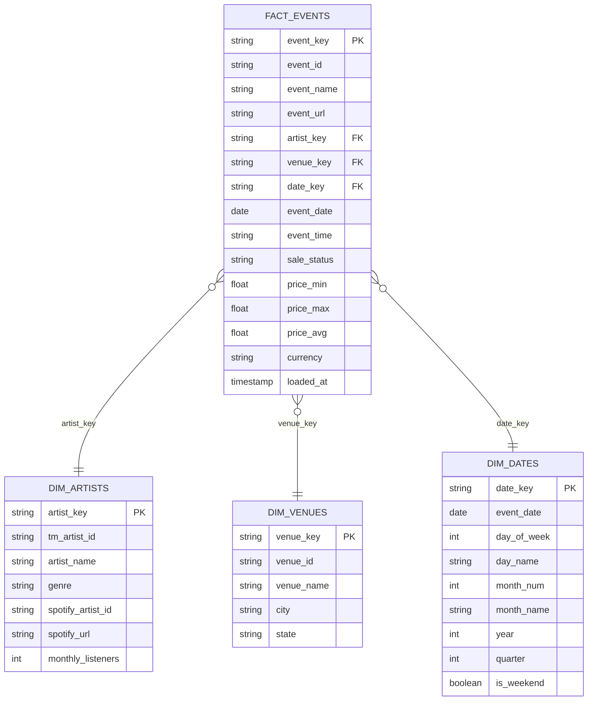
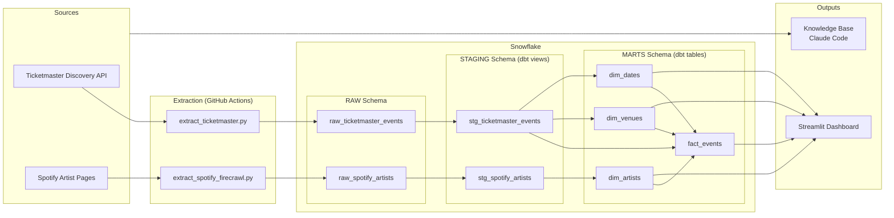

# Live Music Analytics — Project Completion Plan

> **For agentic workers:** REQUIRED SUB-SKILL: Use superpowers:subagent-driven-development (recommended) or superpowers:executing-plans to implement this plan task-by-task. Steps use checkbox (`- [ ]`) syntax for tracking.

**Goal:** Complete all remaining course deliverables — dbt tests, Spotify GitHub Action, Streamlit dashboard, knowledge base, pipeline diagram, ERD, README, and repo cleanup.

**Architecture:** Extend the existing dbt star schema with staging tests, add a second GitHub Actions workflow, build a Streamlit dashboard reading from Snowflake mart tables, scrape 15+ industry sources into a knowledge base, and polish the repo for portfolio presentation.

**Tech Stack:** dbt (Snowflake), GitHub Actions, Streamlit + streamlit-community-cloud, snowflake-connector-python, Python, Mermaid diagrams

---

## File Map

**Create:**
- `dbt_project/models/staging/schema.yml` — staging model tests
- `.github/workflows/extract_spotify.yml` — Spotify extraction automation
- `streamlit_app.py` — dashboard app
- `.streamlit/secrets.toml` — local Snowflake secrets for Streamlit (gitignored)
- `knowledge/raw/*.md` — 15+ raw source files
- `knowledge/wiki/index.md` — knowledge base index
- `knowledge/wiki/overview.md` — industry overview
- `knowledge/wiki/key-entities.md` — major companies/platforms
- `knowledge/wiki/themes.md` — key industry trends

**Modify:**
- `requirements.txt` — add `streamlit`
- `.gitignore` — add `.streamlit/secrets.toml`, `dbt_project/.user.yml`
- `README.md` — full rewrite with template

**Remove from tracking:**
- `dbt_project/.user.yml`
- `data/` directory (unused, raw data lives in Snowflake)

---

## Phase 1: Strengthen the Foundation

### Task 1: Add dbt Staging Tests

**Files:**
- Create: `dbt_project/models/staging/schema.yml`

- [ ] **Step 1: Create staging schema.yml with tests**

```yaml
version: 2

models:
  - name: stg_ticketmaster_events
    description: Staged Ticketmaster event data from raw source
    columns:
      - name: event_id
        description: Ticketmaster event identifier
        tests:
          - not_null
      - name: event_name
        description: Name of the event
        tests:
          - not_null
      - name: event_date
        description: Date of the event
        tests:
          - not_null
      - name: venue_name
        description: Name of the venue
        tests:
          - not_null

  - name: stg_spotify_artists
    description: Staged Spotify artist data from Firecrawl scrape
    columns:
      - name: artist_name
        description: Artist name
        tests:
          - not_null
      - name: monthly_listeners
        description: Spotify monthly listener count
        tests:
          - not_null
```

- [ ] **Step 2: Run dbt test to verify all pass**

```bash
cd /Users/rachelmcdonald/isba-4715/bi-analyst-entertainment
source venv/bin/activate && export $(grep -v '^#' .env | xargs)
cd dbt_project && dbt test 2>&1
```

Expected: All tests pass (existing mart tests + new staging tests).

- [ ] **Step 3: Commit**

```bash
git add dbt_project/models/staging/schema.yml
git commit -m "Add dbt staging model tests for ticketmaster events and spotify artists"
```

---

### Task 2: Add GitHub Actions Workflow for Spotify

**Files:**
- Create: `.github/workflows/extract_spotify.yml`

- [ ] **Step 1: Create the Spotify extraction workflow**

```yaml
name: Daily Spotify Extraction

on:
  schedule:
    - cron: "0 7 * * *"
  workflow_dispatch:

jobs:
  extract:
    runs-on: ubuntu-latest

    steps:
      - name: Checkout repo
        uses: actions/checkout@v4

      - name: Set up Python
        uses: actions/setup-python@v5
        with:
          python-version: "3.12"

      - name: Install dependencies
        run: pip install -r requirements.txt

      - name: Run Spotify extraction
        env:
          FIRECRAWL_API_KEY: ${{ secrets.FIRECRAWL_API_KEY }}
          SNOWFLAKE_ACCOUNT: ${{ secrets.SNOWFLAKE_ACCOUNT }}
          SNOWFLAKE_USER: ${{ secrets.SNOWFLAKE_USER }}
          SNOWFLAKE_PASSWORD: ${{ secrets.SNOWFLAKE_PASSWORD }}
          SNOWFLAKE_WAREHOUSE: ${{ secrets.SNOWFLAKE_WAREHOUSE }}
          SNOWFLAKE_DATABASE: ${{ secrets.SNOWFLAKE_DATABASE }}
          SNOWFLAKE_SCHEMA: ${{ secrets.SNOWFLAKE_SCHEMA }}
        run: python src/extract_spotify_firecrawl.py
```

- [ ] **Step 2: Validate YAML syntax**

```bash
python3 -c "import yaml; yaml.safe_load(open('.github/workflows/extract_spotify.yml'))"
```

Expected: No errors.

- [ ] **Step 3: Commit**

```bash
git add .github/workflows/extract_spotify.yml
git commit -m "Add GitHub Actions workflow for daily Spotify extraction"
```

> **User action required after this task:** Add `FIRECRAWL_API_KEY` to your GitHub repo secrets (Settings → Secrets and variables → Actions → New repository secret).

---

## Phase 2: Build New Deliverables

### Task 3: Create Streamlit Dashboard

**Files:**
- Create: `streamlit_app.py`
- Create: `.streamlit/secrets.toml` (gitignored, for local dev)
- Modify: `requirements.txt` — add `streamlit`
- Modify: `.gitignore` — add `.streamlit/secrets.toml`

- [ ] **Step 1: Add streamlit to requirements.txt**

Add this line to `requirements.txt`:
```
streamlit==1.45.0
```

- [ ] **Step 2: Add .streamlit/secrets.toml to .gitignore**

Append to `.gitignore`:
```
# Streamlit
.streamlit/secrets.toml
```

- [ ] **Step 3: Create local secrets file for Streamlit**

Create `.streamlit/secrets.toml` (this file is gitignored and never committed):

```toml
[snowflake]
account = "MWSXJLP-BKB50014"
user = "rachelmcdonald810"
password = "your-password-here"
warehouse = "COMPUTE_WH"
database = "LIVE_MUSIC_DB"
schema = "RAW"
role = "ACCOUNTADMIN"
```

> **Note:** Fill in the actual password from your `.env` file. This file is gitignored.

- [ ] **Step 4: Create streamlit_app.py**

```python
"""
Live Music Analytics Dashboard
Connects to Snowflake mart tables for descriptive and diagnostic analytics.
"""

import streamlit as st
import snowflake.connector
import pandas as pd

st.set_page_config(page_title="Live Music Analytics", layout="wide")


@st.cache_resource
def get_connection():
    """Connect to Snowflake using Streamlit secrets."""
    return snowflake.connector.connect(
        account=st.secrets["snowflake"]["account"],
        user=st.secrets["snowflake"]["user"],
        password=st.secrets["snowflake"]["password"],
        warehouse=st.secrets["snowflake"]["warehouse"],
        database=st.secrets["snowflake"]["database"],
        schema=st.secrets["snowflake"]["schema"],
        role=st.secrets["snowflake"]["role"],
    )


@st.cache_data(ttl=600)
def run_query(query):
    """Execute a query and return a DataFrame."""
    conn = get_connection()
    cur = conn.cursor()
    cur.execute(query)
    columns = [desc[0] for desc in cur.description]
    data = cur.fetchall()
    return pd.DataFrame(data, columns=columns)


# ── Load data from mart tables ───────────────────────────────────────────────

fact_events = run_query("""
    SELECT f.EVENT_ID, f.EVENT_NAME, f.EVENT_DATE, f.EVENT_TIME,
           f.SALE_STATUS, f.PRICE_MIN, f.PRICE_MAX, f.PRICE_AVG, f.CURRENCY,
           a.ARTIST_NAME, a.GENRE, a.MONTHLY_LISTENERS, a.SPOTIFY_URL,
           v.VENUE_NAME, v.CITY, v.STATE,
           d.DAY_NAME, d.MONTH_NAME, d.YEAR, d.QUARTER, d.IS_WEEKEND
    FROM RAW_MARTS.FACT_EVENTS f
    LEFT JOIN RAW_MARTS.DIM_ARTISTS a ON f.ARTIST_KEY = a.ARTIST_KEY
    LEFT JOIN RAW_MARTS.DIM_VENUES v ON f.VENUE_KEY = v.VENUE_KEY
    LEFT JOIN RAW_MARTS.DIM_DATES d ON f.DATE_KEY = d.DATE_KEY
""")

# ── Sidebar filters ──────────────────────────────────────────────────────────

st.sidebar.header("Filters")

genres = sorted(fact_events["GENRE"].dropna().unique())
selected_genres = st.sidebar.multiselect("Genre", genres, default=genres)

states = sorted(fact_events["STATE"].dropna().unique())
selected_states = st.sidebar.multiselect("State", states, default=states)

price_min_val = float(fact_events["PRICE_AVG"].min() or 0)
price_max_val = float(fact_events["PRICE_AVG"].max() or 500)
price_range = st.sidebar.slider(
    "Avg Price Range ($)",
    min_value=price_min_val,
    max_value=price_max_val,
    value=(price_min_val, price_max_val),
)

# Apply filters
df = fact_events.copy()
df = df[df["GENRE"].isin(selected_genres) | df["GENRE"].isna()]
df = df[df["STATE"].isin(selected_states) | df["STATE"].isna()]
df = df[
    (df["PRICE_AVG"].isna())
    | ((df["PRICE_AVG"] >= price_range[0]) & (df["PRICE_AVG"] <= price_range[1]))
]

# ── Header ────────────────────────────────────────────────────────────────────

st.title("Live Music Analytics Dashboard")
st.markdown("Combining Ticketmaster event data with Spotify streaming metrics for entertainment BI insights.")

# ── Section 1: Event Overview ─────────────────────────────────────────────────

st.header("Event Overview")

col1, col2, col3, col4 = st.columns(4)
col1.metric("Total Events", f"{len(df):,}")
col2.metric("Unique Artists", f"{df['ARTIST_NAME'].nunique():,}")
col3.metric("Unique Venues", f"{df['VENUE_NAME'].nunique():,}")
avg_price = df["PRICE_AVG"].mean()
col4.metric("Avg Ticket Price", f"${avg_price:,.2f}" if pd.notna(avg_price) else "N/A")

genre_counts = df.groupby("GENRE").size().reset_index(name="count").sort_values("count", ascending=False)
st.subheader("Events by Genre")
st.bar_chart(genre_counts.set_index("GENRE")["count"])

# ── Section 2: Pricing Analytics ──────────────────────────────────────────────

st.header("Pricing Analytics")

col1, col2 = st.columns(2)

with col1:
    st.subheader("Average Price by Genre")
    price_by_genre = (
        df.groupby("GENRE")["PRICE_AVG"]
        .mean()
        .reset_index()
        .sort_values("PRICE_AVG", ascending=False)
    )
    st.bar_chart(price_by_genre.set_index("GENRE")["PRICE_AVG"])

with col2:
    st.subheader("Price Distribution")
    price_data = df["PRICE_AVG"].dropna()
    if not price_data.empty:
        st.bar_chart(price_data.value_counts(bins=20).sort_index())

# ── Section 3: Artist Insights (Diagnostic) ──────────────────────────────────

st.header("Artist Insights")
st.markdown("**Diagnostic:** Do streaming-popular artists have more live events?")

artist_stats = (
    df.groupby("ARTIST_NAME")
    .agg(event_count=("EVENT_ID", "count"), monthly_listeners=("MONTHLY_LISTENERS", "first"))
    .reset_index()
    .dropna(subset=["monthly_listeners"])
)

if not artist_stats.empty:
    st.scatter_chart(
        artist_stats,
        x="monthly_listeners",
        y="event_count",
        size="event_count",
    )
    st.caption("Each dot is an artist. X-axis = Spotify monthly listeners, Y-axis = number of live events.")
else:
    st.info("No artists with both event and Spotify data available.")

# ── Section 4: Venue & Geography ──────────────────────────────────────────────

st.header("Venue & Geography")

col1, col2 = st.columns(2)

with col1:
    st.subheader("Events by State")
    state_counts = df.groupby("STATE").size().reset_index(name="count").sort_values("count", ascending=False)
    st.bar_chart(state_counts.set_index("STATE")["count"])

with col2:
    st.subheader("Top 10 Venues")
    top_venues = (
        df.groupby(["VENUE_NAME", "CITY", "STATE"])
        .size()
        .reset_index(name="Events")
        .sort_values("Events", ascending=False)
        .head(10)
    )
    st.dataframe(top_venues, use_container_width=True, hide_index=True)

# ── Section 5: Time Trends ───────────────────────────────────────────────────

st.header("Time Trends")

col1, col2 = st.columns(2)

day_order = ["Monday", "Tuesday", "Wednesday", "Thursday", "Friday", "Saturday", "Sunday"]

with col1:
    st.subheader("Events by Day of Week")
    dow_counts = df.groupby("DAY_NAME").size().reset_index(name="count")
    dow_counts["DAY_NAME"] = pd.Categorical(dow_counts["DAY_NAME"], categories=day_order, ordered=True)
    dow_counts = dow_counts.sort_values("DAY_NAME")
    st.bar_chart(dow_counts.set_index("DAY_NAME")["count"])

with col2:
    st.subheader("Weekend vs Weekday")
    weekend_counts = df.groupby("IS_WEEKEND").size().reset_index(name="count")
    weekend_counts["IS_WEEKEND"] = weekend_counts["IS_WEEKEND"].map({True: "Weekend", False: "Weekday"})
    st.bar_chart(weekend_counts.set_index("IS_WEEKEND")["count"])
```

- [ ] **Step 5: Test the dashboard locally**

```bash
cd /Users/rachelmcdonald/isba-4715/bi-analyst-entertainment
source venv/bin/activate
pip install streamlit==1.45.0
streamlit run streamlit_app.py
```

Expected: Dashboard opens in browser at localhost:8501, showing charts with real Snowflake data.

- [ ] **Step 6: Commit**

```bash
git add streamlit_app.py requirements.txt .gitignore
git commit -m "Add Streamlit dashboard with descriptive and diagnostic analytics"
```

> **User action required after this task:**
> 1. Create a Streamlit Community Cloud account at share.streamlit.io
> 2. Connect your GitHub repo
> 3. Set the main file to `streamlit_app.py`
> 4. Add Snowflake secrets in the Streamlit Cloud dashboard (same format as `.streamlit/secrets.toml`)

---

### Task 4: Build Knowledge Base — Raw Sources

**Files:**
- Create: `knowledge/raw/` — 15+ markdown files

- [ ] **Step 1: Create knowledge/raw/ directory**

```bash
mkdir -p /Users/rachelmcdonald/isba-4715/bi-analyst-entertainment/knowledge/raw
mkdir -p /Users/rachelmcdonald/isba-4715/bi-analyst-entertainment/knowledge/wiki
```

- [ ] **Step 2: Scrape and create 15+ raw source files**

Use web search and fetch to gather sources from 3+ sites about why combining streaming and live performance data matters. Each file should be saved as markdown in `knowledge/raw/` with this format:

```markdown
# [Article Title]

- **Source:** [Site Name]
- **URL:** [full URL]
- **Author:** [author if available]
- **Date:** [publication date if available]

## Content

[Scraped or summarized content from the source]
```

**Required topics and sources (minimum 15 files from 3+ sites):**

From **Billboard / Music Business Worldwide / Pollstar** (industry trade press):
1. How streaming data predicts touring demand
2. Concert industry revenue trends post-pandemic
3. Live music boom and ticket pricing economics
4. Fan engagement analytics in live entertainment
5. Data-driven booking and tour routing

From **Forbes / Rolling Stone / Business press**:
6. Live Nation earnings and market dominance
7. AEG/AXS business model and data strategy
8. Dynamic pricing in concert tickets
9. Artist revenue split: streaming vs touring
10. The economics of festival vs arena shows

From **Spotify blog / Company press releases / Industry reports**:
11. Spotify for Artists analytics platform
12. How Spotify data helps artists plan tours
13. Ticketmaster data and market insights
14. Music industry revenue breakdown (RIAA/IFPI)
15. Audience segmentation in entertainment analytics

File naming: `knowledge/raw/01-streaming-predicts-touring.md`, `knowledge/raw/02-concert-revenue-trends.md`, etc.

- [ ] **Step 3: Commit raw sources**

```bash
git add knowledge/raw/
git commit -m "Add 15+ raw knowledge base sources from industry publications"
```

---

### Task 5: Build Knowledge Base — Wiki Pages

**Files:**
- Create: `knowledge/wiki/overview.md`
- Create: `knowledge/wiki/key-entities.md`
- Create: `knowledge/wiki/themes.md`
- Create: `knowledge/wiki/index.md`

- [ ] **Step 1: Generate overview.md**

Synthesize the raw sources into an industry landscape overview covering:
- Why streaming + live data convergence is the defining trend in entertainment analytics
- The business case for combining ticketing and streaming data
- How this project demonstrates real BI analyst workflows

- [ ] **Step 2: Generate key-entities.md**

Document major companies, platforms, and stakeholders:
- **Live entertainment:** AEG/AXS, Live Nation/Ticketmaster, Pollstar
- **Streaming:** Spotify, Apple Music, Amazon Music
- **Data/analytics:** Bandsintown, Chartmetric, Luminate
- For each: what they do, their data assets, their role in the ecosystem

- [ ] **Step 3: Generate themes.md**

Document key industry trends:
- Streaming-to-touring pipeline
- Data-driven booking and tour routing
- Dynamic pricing and yield management
- Fan segmentation and audience analytics
- Post-pandemic live music economics

- [ ] **Step 4: Generate index.md**

Create the knowledge base index:
```markdown
# Knowledge Base Index

## Wiki Pages
- [Industry Overview](wiki/overview.md) — Landscape of streaming + live entertainment data convergence
- [Key Entities](wiki/key-entities.md) — Major companies, platforms, and stakeholders
- [Industry Themes](wiki/themes.md) — Key trends driving entertainment analytics

## Raw Sources
[Numbered list of all 15+ raw source files with titles and source sites]
```

- [ ] **Step 5: Commit wiki pages**

```bash
git add knowledge/wiki/
git commit -m "Add knowledge base wiki pages with overview, entities, themes, and index"
```

---

### Task 6: Create ERD Diagram

**Files:**
- This task produces a Mermaid ERD string to be embedded in README (Task 9).

- [ ] **Step 1: Generate ERD from dbt mart models**

Create this Mermaid ER diagram based on the existing dbt models:



This will be embedded in the README in Task 9.

- [ ] **Step 2: Commit (combined with README in Task 9)**

No separate commit — ERD is embedded in README.

---

### Task 7: Create Pipeline Diagram

**Files:**
- This task produces a Mermaid flowchart to be embedded in README (Task 9).

- [ ] **Step 1: Generate pipeline diagram**

Create this Mermaid flowchart covering all layers:



This will be embedded in the README in Task 9.

- [ ] **Step 2: Commit (combined with README in Task 9)**

No separate commit — diagram is embedded in README.

---

## Phase 3: Polish

### Task 8: Repo Cleanup

**Files:**
- Modify: `.gitignore`
- Remove from tracking: `dbt_project/.user.yml`, `data/` directory

- [ ] **Step 1: Update .gitignore**

Append to `.gitignore`:
```
# dbt user config
dbt_project/.user.yml

# Data directory (raw data lives in Snowflake)
data/
```

- [ ] **Step 2: Remove files from git tracking**

```bash
cd /Users/rachelmcdonald/isba-4715/bi-analyst-entertainment
git rm --cached dbt_project/.user.yml
git rm -r --cached data/
```

- [ ] **Step 3: Remove empty data directory**

```bash
rm -rf /Users/rachelmcdonald/isba-4715/bi-analyst-entertainment/data/
```

- [ ] **Step 4: Verify no secrets or scratch files**

```bash
git status
# Confirm only expected files are tracked
# Verify .env is NOT in git tracking
git ls-files | grep -i -E '\.env$|secret|credentials|scratch|test_output'
```

Expected: No matches (only `.env.example` is OK).

- [ ] **Step 5: Commit**

```bash
git add .gitignore
git commit -m "Clean repo: remove tracked artifacts, update gitignore"
```

---

### Task 9: Rewrite README

**Files:**
- Modify: `README.md`

- [ ] **Step 1: Rewrite README with course template format**

The README should include these sections in order:
1. Project title and one-line description
2. Project Overview (2-3 paragraphs: what, why, who it's for)
3. Tech Stack (table: tool + purpose)
4. Data Sources (table: source, type, data, script)
5. Pipeline Diagram (Mermaid from Task 7)
6. ERD — Star Schema (Mermaid from Task 6)
7. Pipeline Setup (numbered steps: clone, install, configure, run extraction, run dbt)
8. Dashboard (screenshot placeholder + public URL placeholder)
9. Insights Summary (key findings from the data — 3-5 bullet points)
10. Knowledge Base (description + link to index.md)
11. Repository Structure (tree diagram)

Embed the Mermaid ERD from Task 6 and pipeline diagram from Task 7 directly in the README.

- [ ] **Step 2: Commit**

```bash
git add README.md
git commit -m "Rewrite README with complete project documentation, ERD, and pipeline diagram"
```

---

### Task 10: Draft Presentation Slide Content

**Files:**
- Create: `docs/slide-content.md`

- [ ] **Step 1: Draft slide content outline**

Create a markdown file with suggested slide content:

```markdown
# Presentation Slide Content

## Slide 1: Title
- Live Music Analytics Pipeline
- Rachel McDonald
- ISBA 4715

## Slide 2: Problem Statement
- Entertainment companies need to connect streaming popularity with live event performance
- Currently, ticketing and streaming data live in silos
- BI analysts at companies like AXS (AEG) need unified views

## Slide 3: Solution — Data Pipeline
- [Insert pipeline diagram screenshot]
- Sources: Ticketmaster API + Spotify (Firecrawl)
- Warehouse: Snowflake star schema
- Transform: dbt staging + mart models
- Visualize: Streamlit dashboard

## Slide 4: Star Schema Design
- [Insert ERD screenshot]
- fact_events: 200 events with pricing, status, dimensions
- dim_artists: 146 artists with Spotify metrics joined
- dim_venues: 184 venues with location
- dim_dates: temporal attributes for time analysis

## Slide 5: Descriptive Insights
- [Pull actual numbers from dashboard after it's running]
- Top genres by event count
- Price ranges across genres
- Geographic distribution of events
- Weekend vs weekday patterns

## Slide 6: Diagnostic Insights
- Do streaming-popular artists have more live events?
- [Scatter plot screenshot from dashboard]
- Which genres command higher ticket prices?
- What day-of-week patterns exist?

## Slide 7: Recommendations
- Use streaming metrics as leading indicators for booking decisions
- Price optimization based on artist popularity tiers
- Geographic expansion opportunities based on event density gaps
- Weekend-heavy scheduling suggests weekday promotional opportunity

## Slide 8: Tech Stack & Portfolio Value
- End-to-end pipeline: extraction, warehousing, transformation, visualization
- Automated with GitHub Actions
- Knowledge base demonstrates research depth
- Mirrors real Sr. BI Analyst workflows at AXS/AEG
```

- [ ] **Step 2: Commit**

```bash
git add docs/slide-content.md
git commit -m "Add presentation slide content outline"
```

> **User action required:** Build the actual PDF slides in Google Slides or PowerPoint using this content. Add screenshots from the deployed dashboard.
